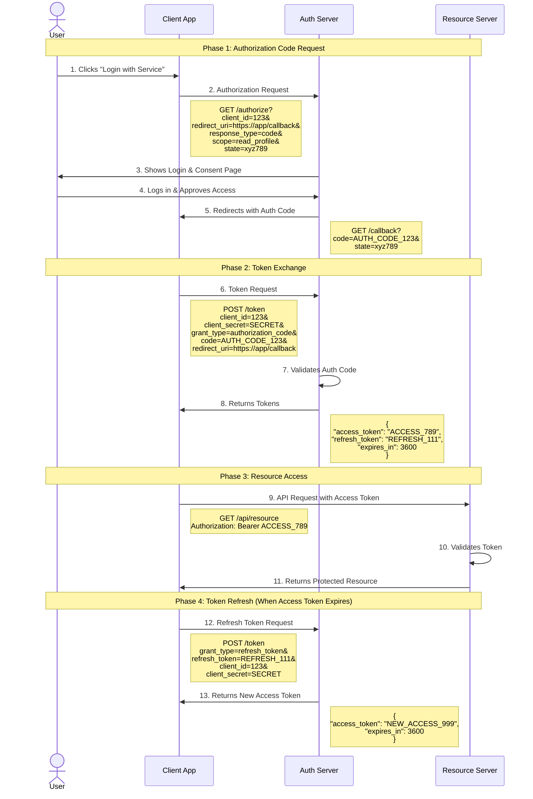
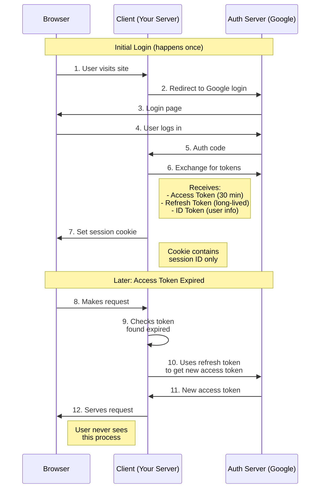
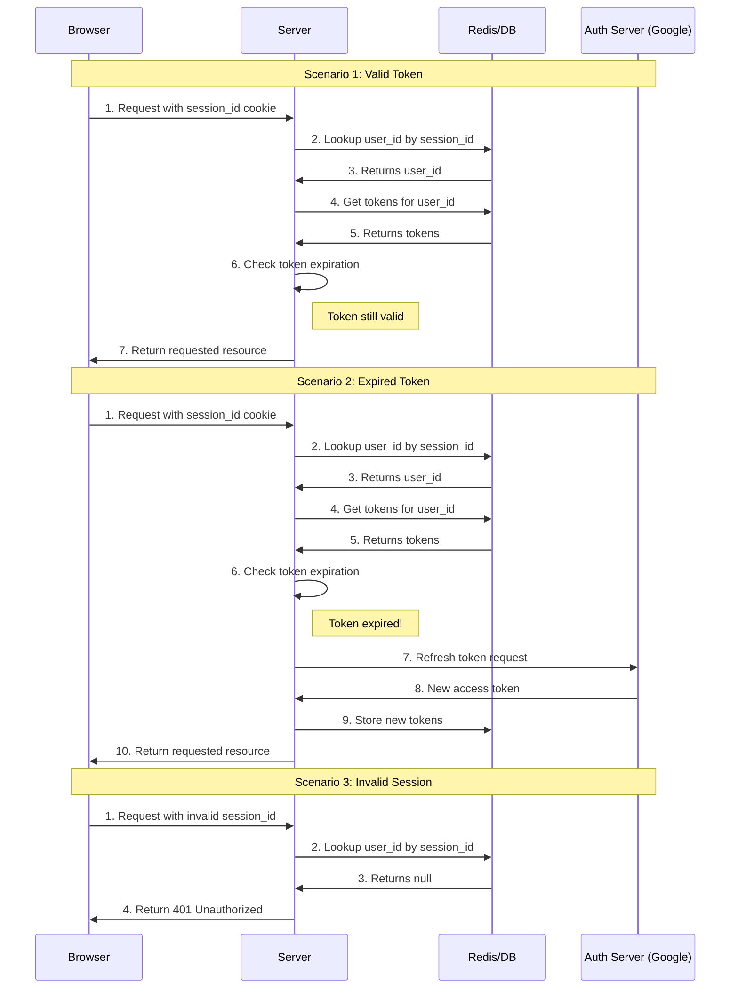
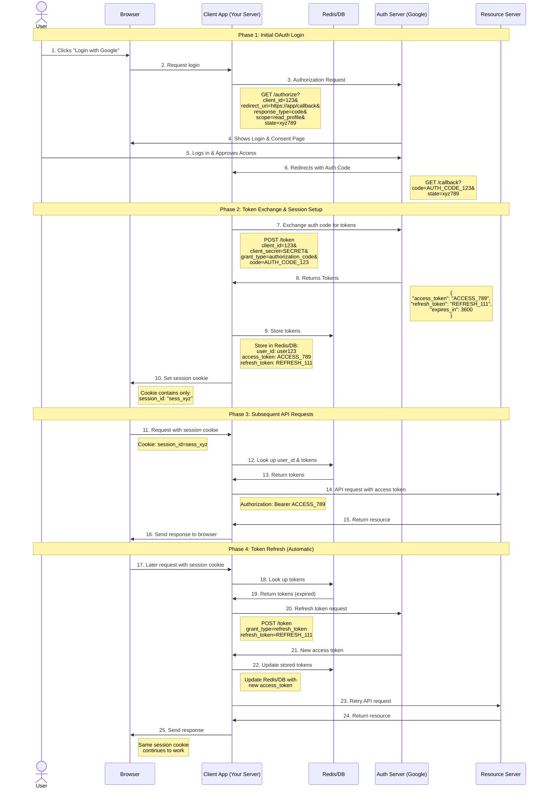

# Notes on OAuth 2.0

OAuth 2.0 is an open authorization framework that allows applications to access resources on behalf of a user, without exposing the user's credentials. It enables secure access by providing access tokens for API requests, facilitating delegated permissions across services.

**Security:**

- Tokens never exposed to browser
- Session cookie only contains session ID
- Session cookie typically expires in 24 hours or on browser close
- Tokens stored securely on server

**User Experience:**

- Seamless token refresh
- No need to re-login when token expires
- Single sign-on benefits
## Phases

## Token Refreshing Process

## Token Validation Process

## token flow

