[Django-socio-grpc](https://github.com/socotecio/django-socio-grpc) (DSG) is a framework for using gRPC with Django. It builds upon django-rest-framework (DRF), making it easy for those familiar with DRF to get started with DSG.

Although I decided to go back to DRF after exploring DSG, I chose to do so because I needed to get things done quickly. Using gRPC is considered a potential way to achieve performance gains, and there are some obstacles need to be addressed before going full gRPC. I'm leaving these notes as my learning experience.

## The workflow 
Using django-socio-grpc (DSG) the workflow is like following:

```mermaid
flowchart TD
  subgraph backend[Backend Side]
	  db-schema[Design Database Schema] --> |create| django-models[Django Models] --> |define| serializers
	  pb-backend[Protocol Buffers]	  
	  django-models --> server-app[Server Application]
	  django-models --> |migrate| database
  end

  subgraph protobuf-repo[Protobuf repository]
	  .proto[.proto] --> |run| buf-lint[buf lint] --> |detect| buf-check[Breaking Change] --> |if pass|protobuf-gen[Generate Code]
	  protobuf-gen --> server-stub[gRPC Server skeleton]
	  protobuf-gen --> client-stub[gRPC Client Stub]
	  protobuf-gen --> mypy-types[.pyi type stub]
  end

  subgraph frontend[Frontend Side]
	  pb-frontend[Protocol Buffers]
		client-app[Client Application] --> |call| client-stub
  end

  serializers --> |DSG generates| .proto

  server-app --> |implement| server-stub
  server-stub --> |serializes| pb-backend

  mypy-types --> server-app

  client-stub --> |serializes| pb-frontend
  pb-backend <--> |binary format over HTTP/2| pb-frontend
```




## Make DSG aware of big integer model fields
Currently DSG (version 0.24.3) has an issue of mapping some model fields to `int32` type in protobuf incorrectly due to DRF's decision, they should be mapped to `int64` type.

It's kind of hard to implement at library level, in application level I implemented something like this, using `BigIntAwareModelProtoSerializer` as the parent class of the proto serializer will correctly map `BigAutoField` `BigIntegerField` `PositiveBigIntegerField` to `int64` type in protobuf.

```python
from django.db import models
from django_socio_grpc import proto_serializers
from rest_framework import serializers

class BigIntegerField(serializers.IntegerField):
    """Indicate that this filed should be converted to int64 on gRPC message.

    This should apply to
    - models.BigAutoField.
    - models.BigIntegerField
    - models.PositiveBigIntegerField

    rest_framework.serializers.ModelSerializer.serializer_field_mapping
    maps django.models.BitIntegerField to serializer.fields.IntegerField.

    Although the value bounds are set correctly, django-socio-grpc can only map it to int32,
    we need to explicitly mark it for django-socio-grpc to convert it to int64.
    """

    proto_type = "int64"

# First, get the metaclass of ModelProtoSerializer
ModelProtoSerializerMetaclass = type(proto_serializers.ModelProtoSerializer)

class BigIntegerSerializerMetaclass(ModelProtoSerializerMetaclass):
    def __new__(mcs, name, bases, attrs):  # noqa: D102 ANN001 ANN204 N804
        # First, let's modify the serializer_field_mapping if it exists
        for base in bases:
            if hasattr(base, "serializer_field_mapping"):
                # Create a new mapping dictionary inheriting from the base
                field_mapping = dict(base.serializer_field_mapping)
                # Update the mapping for BigInteger fields
                field_mapping.update(
                    {
                        models.BigIntegerField: BigIntegerField,
                        models.BigAutoField: BigIntegerField,
                        models.PositiveBigIntegerField: BigIntegerField,
                    }
                )
                # Add the modified mapping to attrs
                attrs["serializer_field_mapping"] = field_mapping
                break

        # Then proceed with the normal class creation
        return super().__new__(mcs, name, bases, attrs)

class BigIntAwareModelProtoSerializer(proto_serializers.ModelProtoSerializer, metaclass=BigIntegerSerializerMetaclass):
    """A ModelProtoSerializer that automatically converts Django BigInteger fields to gRPC int64 fields by modifying the field mapping."""
```

## Major obstacles for using gRPC

The biggest obstacle is that browsers do not natively support gRPC, which relies on HTTP/2.0. As a result, client-side frontend calls to backend services from a browser using gRPC require a proxy, typically Envoy. This setup involves additional overhead, such as configuring a dedicated API gateway or setting up an ingress. Even with a service mesh like Istio, some extra work is still necessary.

The next challenge is how to corporate with existing RESTful services if we chose to add a gRPC service. For communications happen between RESTful service and gRPC service, a gRPC-JSON transcoder (for example [Enovy](https://www.envoyproxy.io/docs/envoy/latest/configuration/http/http_filters/grpc_json_transcoder_filter)) is need so that HTTP/JSON can be converted to gRPC. Again some extra work is needed at infrastructure level.

The last part of using gRPC is that data is transferred in binary form (which is the whole point of using gRPC for performance) makes it a little bit harder for debugging.

## Conclusion
Django-socio-grpc is solid and its documentation is good. However, the major issue is the overhead work that comes with using gRPC. I will consider it again when I need extra performance and my team's tech stack is adapted to gRPC.