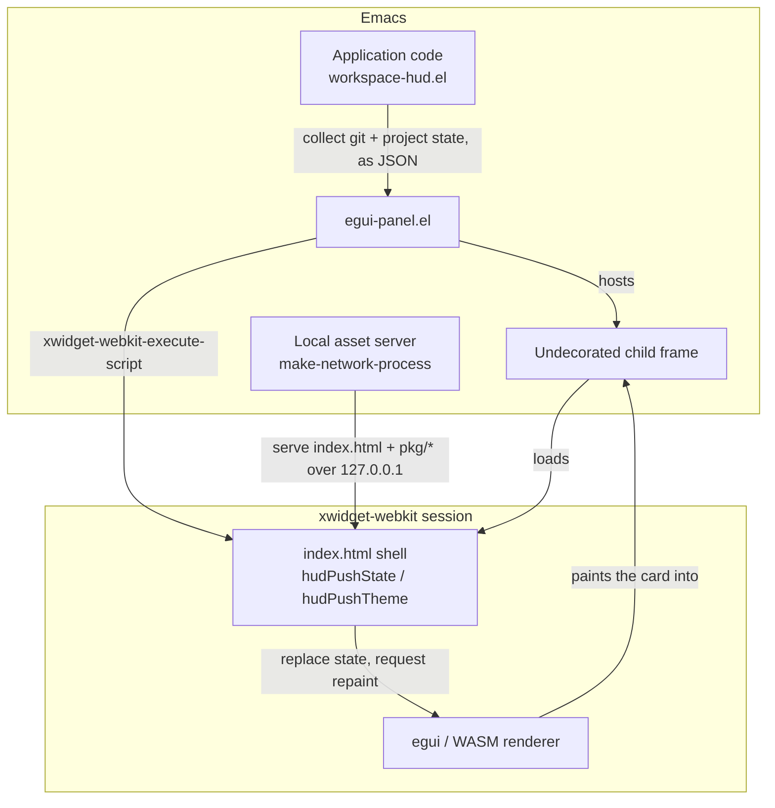

Emacs has an unusually flexible UI, but most of that flexibility still lives inside a rigid layout model. Buffers, windows, side windows, mode lines, minibuffers, and popups all compete for the same rectangular grid. Everything you see is, in the end, a region of that grid.

I wanted to try a different shape. Not another buffer fighting for space, but a small floating HUD pinned to the Emacs frame, sitting outside the normal layout entirely, with a modern visual style and a live data feed coming from Emacs Lisp.

The goal was never to replace Emacs buffers. It was to give Emacs a new kind of surface for information that should be glanceable, persistent, and visually compact: the sort of thing you want hovering in a corner, not occupying a window split.

## The HUD Idea

The first concrete target was a workspace HUD: a card in the corner of the frame showing project status, git state, and whatever context is relevant to the buffer I happen to be editing.

That sounds simple, but it pushes against a handful of Emacs defaults. A normal buffer participates in the window layout, so it takes up space you have to manage. A popup tends to be transient and focus-sensitive, so it disappears the moment you look away. A mode line is wonderfully compact but visually boxed in. A child frame can genuinely float, but it asks for careful handling around sizing, positioning, focus, and cleanup.

What I wanted was closer to a small native overlay than to any of these: Emacs would still own all of the editor state, and the HUD would do nothing but render the state it was handed.

Getting there meant trying a few approaches and discarding most of them. The path below is roughly the order I worked through them.

## Spike 1: A Text Child Frame

The first experiment was the most boring one on purpose: a plain Emacs child frame holding a text buffer.

It was boring, but it was also the experiment that proved the windowing idea was sound. A child frame can be parent-relative, undecorated, and non-focusable. It can be repositioned when the parent frame moves, and it can be kept out of the normal window-split layout. In other words, it can behave like an overlay rather than a window.

That was enough to confirm the HUD could exist as a stable surface. It was not enough for the look I was after. Text rendered into a buffer still reads as a clever mode line, not as a modern panel, and no amount of careful formatting was going to change that.

## Spike 2: SVG in a Child Frame

So the next step was to render the card as SVG instead of text.

Visually, this got much closer to the target: rounded panels, custom spacing, real vector shapes, theme-aware colors. For a while it felt like the answer. Then the portability problem showed up.

SVG support in Emacs depends heavily on how Emacs was built. With solid `librsvg` support the result can look great, but on some macOS builds native SVG rendering is far more limited, and details like filters and CSS may not behave the same way from one machine to the next. SVG turned out to be a great design probe and a poor foundation. I could prototype the look, but I couldn't depend on it.

## Spike 3: A Native WebView

If I wanted a real rendering canvas, the obvious move was a real web view, so the third experiment reached for a native WebKit view through Appine.

The rendering model was genuinely attractive. A web view hands you a full browser canvas, and that opens the door to richer UI toolkits than anything Emacs renders natively. The trouble was lifecycle and composition rather than rendering. A persistent HUD has to coexist quietly with other web views and with ordinary Emacs use, and the native WebView wanted too much ownership over the viewport to do that gracefully. It was a promising route for an active web *panel*, but an awkward one for a background HUD that's meant to stay out of the way.

## Spike 4: xwidget-webkit

The fourth experiment used Emacs' own built-in `xwidget-webkit`, and this was the first version where every piece fit together at once.

`xwidget-webkit` can host a browser surface directly inside Emacs. That surface can live inside a child frame, multiple WebKit sessions can coexist without stepping on each other, and the page itself can run WebAssembly. Best of all, Emacs Lisp can reach into the page and push data with `xwidget-webkit-execute-script`. That last point is what made the whole HUD idea practical: Emacs stays in charge, and the page just listens.

There were still some Emacs-specific rough edges to sand down. `xwidget-webkit-new-session` behaves like an interactive command and will happily disturb the user's window layout, so the implementation saves and restores window configurations around session creation. The xwidget buffer also needs to be stripped of everything that marks it as a buffer — no mode line, no header line, no fringes, no line numbers — and tearing it down has to bypass the usual xwidget kill confirmation. None of that is hard once you know it's there, and with those details handled, `xwidget-webkit` became a dependable host for the HUD.

## The Current Architecture

The architecture that came out of these spikes is intentionally small, and the boundary it draws is the whole point: Emacs owns state, timing, and editor integration, while egui owns layout and drawing. Nothing crosses that line except JSON.



On the Emacs side, `egui-panel.el` does the heavy lifting. It starts a tiny local HTTP server with `make-network-process`, serves `index.html` and the generated WASM bundle from `127.0.0.1`, creates the undecorated child frame, loads `xwidget-webkit` inside it, and pushes theme and state as JSON.

The local server is the one piece that looks like overkill until you hit the wall that requires it: WebKit refuses to instantiate WebAssembly from a `file://` origin. Keeping a small server *inside* Emacs sidesteps that without dragging in npm, a global web server, or a separate daemon.

The renderer itself is an egui app compiled to WebAssembly. Its HTML shell exposes just two entry points:

```javascript
window.hudPushState(json)
window.hudPushTheme(json)
```

Emacs calls those through `xwidget-webkit-execute-script`, and on the other side the WASM app swaps in the new state and asks egui to repaint. With that bridge in place, the workspace HUD demo collapses into a thin data source. A buffer, window, or save event triggers Emacs to gather project and git state, serialize it to JSON, hand it to `xwidget-webkit`, and let egui repaint:

```text
buffer/window/save event
  -> collect project and git state in Emacs Lisp
  -> JSON payload
  -> xwidget-webkit
  -> egui repaint
```

Because the contract is just JSON in one direction, each side stays replaceable. Emacs doesn't know how the card is drawn, and the renderer doesn't know where the data came from.

## Why This Feels Promising

The interesting result isn't simply that the HUD works. It's that Emacs gains a new UI surface without giving up any of the things that make Emacs worth using in the first place.

The editor stays Emacs Lisp-driven. The renderer is replaceable. And because the HUD lives outside the window layout, it never steals a split or forces itself into the buffer model — it just floats there, showing what Emacs tells it to show.

There's still plenty left to explore: click-back from the HUD into Emacs commands, multiple panel roles, richer theming, and a tighter workspace design. But the core shape is settled, and it's a short one:

```text
Emacs Lisp state -> JSON -> xwidget-webkit -> egui/WASM HUD
```

For an idea that started as nothing more than "what if Emacs had a modern floating HUD?", that's a good place to have landed.

The project is available at [GitHub - nohzafk/emacs-workspace-hud: A floating workspace status HUD for Emacs, showing Git, LSP, and diagnostic state in a WebAssembly-powered egui card. · GitHub](https://github.com/nohzafk/emacs-workspace-hud), and it's also extensible to add more sections to the HUD.