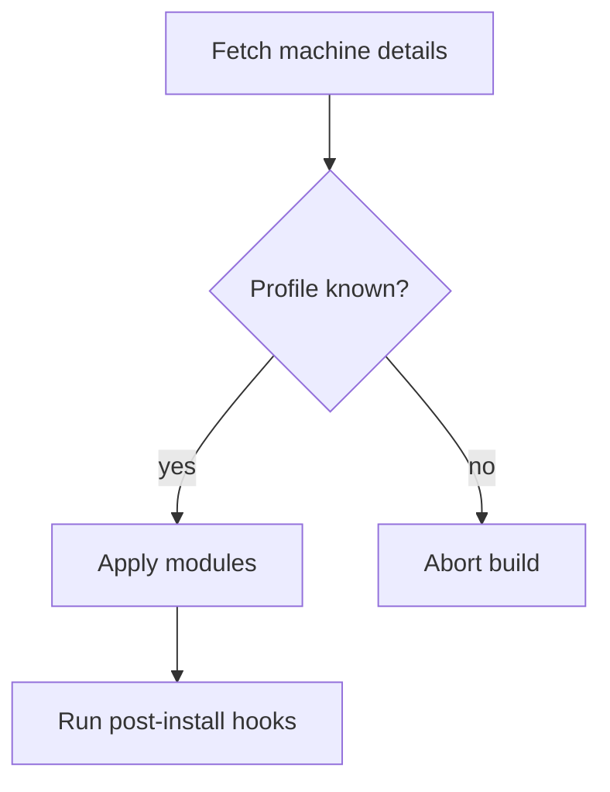
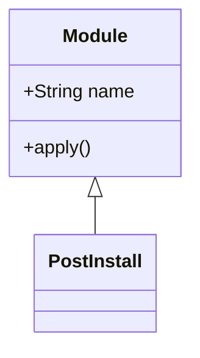

I went looking for why a diagram-rendering tool on my machine depended on Google Chrome, and came out with three renderers benchmarked and two assumptions broken.

The setup: I have a small tool that turns conversation context into a Mermaid diagram and renders it as a PNG. It called `mmdc`, the official Mermaid CLI. `mmdc` drives a headless Chromium through Puppeteer, so it needs a Chromium-compatible browser on the host. Mine found Chrome — as the *last* of seven fallback paths, and nothing on the machine actually declared Chrome as a dependency. It worked by luck. One `brew uninstall` away from breaking.

So: is there a Mermaid renderer that doesn't need a browser?

## Why This Is Hard at All

Mermaid is a JavaScript library that renders to SVG using browser APIs. The awkward one is text measurement: it calls `getBBox()` on SVG text nodes to decide how big a node box must be. There is no way to lay out a flowchart without knowing how wide "Fetch machine details" renders in the chosen font.

That leaves four strategies, and every tool in this space picks one:

1. **Ship a browser.** Run real Mermaid in real Chromium. This is `mmdc`.
2. **Shim the DOM.** Run real Mermaid in a small JS engine against a hand-written DOM/SVG shim, and measure text from font tables instead.
3. **Reimplement.** Port Mermaid's parsing and layout to a native language.
4. **Call a service.** Send the diagram to something like mermaid.ink. Off the table for me — work diagrams shouldn't leave the machine.

I tested one of each of the first three.

## The Candidates

| | Strategy | Language | Install |
|---|---|---|---|
| [`@mermaid-js/mermaid-cli`](https://github.com/mermaid-js/mermaid-cli) 11.16.0 | Real Mermaid in Chromium | Node | `npm i -g` + a browser |
| [`mermaidx`](https://github.com/MohammadRaziei/mermaidx) 0.9.4 | Real Mermaid in QuickJS + resvg | Python | `pip install mermaidx` |
| [`merman-cli`](https://github.com/Latias94/merman) 0.7.0 | Native reimplementation | Rust | `cargo install merman-cli` |

`mermaidx` bundles Mermaid v11.16.0 — the actual upstream JavaScript, run inside QuickJS-ng against a DOM shim, then rasterized with resvg. `merman` reimplements Mermaid in Rust and currently tracks `mermaid@11.16.1`; Zed uses it as its Rust Mermaid backend.

Install effort split cleanly. `mermaidx` was four pure wheels, about 3 MB, done in seconds. `merman` was a 1m45s release compile. `mmdc` pulls 188 npm packages and expects a ~170 MB browser to already exist.

## Method

Apple M4, 10 cores, macOS 15.7.7. Node v24.15.0, Chrome 151.0.7922.140. `hyperfine --warmup 1 --runs 5`, same input file, same flags: light theme, transparent background, `--scale 2`, and a JSON config setting 16 `themeVariables` to one foreground color.

The test diagram:

## Results

| | Mean time | σ | vs merman |
|---|---|---|---|
| `merman-cli` | **125.2 ms** | 2.2 ms | — |
| `mmdc` | 3.021 s | 84 ms | 24× slower |
| `mermaidx` | 6.242 s | 44 ms | 50× slower |

Then the output dimensions, which turned out to matter more than the timings:

| | Flowchart | Class diagram |
|---|---|---|
| `mmdc` | 794×1020 | 322×588 |
| `merman-cli` | **794×1020** | **322×588** |
| `mermaidx` | 860×1034 | 378×580 |

`merman` matches `mmdc` exactly on both diagrams. The native reimplementation reproduces upstream layout to the pixel.

## Surprise 1: Real Mermaid Was the Slow One

I expected `mermaidx` to sit between the other two. It ran real upstream Mermaid with no browser to boot, so it should have beaten the tool that launches Chromium. It came last — twice as slow as `mmdc`.

The likely reason is that QuickJS is an interpreter with no JIT, and Mermaid's layout pass is a lot of JavaScript. Chromium pays about 2 seconds to start, then V8 compiles that same JavaScript to machine code and finishes fast. Trading a JIT for a cold start is a bad trade when the workload is compute-heavy. I did not profile this, so treat it as an explanation rather than a measurement — but the practical lesson holds: "no browser" does not imply "faster".

One caveat on that 3.0 s figure for `mmdc`. My very first run took 12.6 s. That is the real cost the first time you render after a reboot, and it is what you feel in interactive use. Steady state is 3 s.

## Surprise 2: The foreignObject Inversion

Non-browser SVG renderers — resvg, librsvg, Inkscape — do not implement `<foreignObject>`. Mermaid uses `<foreignObject>` for HTML labels by default, so its SVG output often loses all text outside a browser. The documented fix is `htmlLabels: false`, which makes Mermaid emit native `<text>` instead.

I expected the tool running real Mermaid to have this problem and the Rust reimplementation to have solved it. It is exactly backwards:

| SVG output | `<foreignObject>` | `<text>` |
|---|---|---|
| `mermaidx` | 0 | 9 |
| `merman-cli` | 18 | 0 |

`mermaidx` emits zero `foreignObject` — even for `classDiagram` and `erDiagram`, which the Mermaid docs say use it regardless of `htmlLabels`. Its DOM shim simply has no `foreignObject` path, so everything becomes native `<text>`. Its SVG opens correctly in anything.

`merman` is the opposite: its SVG is all `foreignObject` and no `<text>`. That is harmless for its PNG output, because `merman` rasterizes the labels itself in its own Rust pipeline. But its SVG will render textless in Emacs, Inkscape, or any librsvg-based viewer. That is the same class of gap I hit when [my Mermaid arrows disappeared in Emacs](/posts/2026-05-25-why-my-mermaid-arrows-disappeared-in-emacs/) — valid SVG, incomplete renderer, silent result.

This is the kind of thing that bites six months later. If you pick `merman`, write down that you must emit PNG, and why — otherwise switching to SVG looks like a free optimization and silently produces empty boxes.

## Surprise 3: Font Metrics Clip Text

Approximating text measurement has a visible failure mode. Same class diagram, same flags, dark theme:

`mermaidx`:

`merman-cli`:

`mermaidx` clips "PostInstall". Mermaid sized that box using the font `mermaidx` measured with, resvg rasterized with a different one, and the bold header overflowed. Note the dimensions from the table: 378×580 against `mmdc`'s 322×588 — wider *and* shorter. The layout genuinely differs, it is not a rasterizing artifact.

Both tools exited 0. Nothing warned me. I only caught it by looking at the picture, which is worth remembering when you automate diagram generation: an image renderer can fail successfully.

For comparison, the flowchart case where everything works. `mmdc`:

`merman-cli`:

## What I Picked

`merman-cli`, for a renderer feeding PNGs into an editor:

- 24× faster than `mmdc`, and 125 ms is fast enough to feel synchronous
- No browser, so the dependency is one declared binary
- Pixel-identical layout to `mmdc` on both test diagrams
- `themeVariables` honored, transparent PNG with a real alpha channel
- A drop-in flag set: `-i`, `-o`, `-t`, `-b`, `--scale`, `--configFile`, and even `-p/--puppeteerConfigFile` accepted as a no-op, so existing `mmdc` command lines work unchanged
- Clean failures: exit 1, no partial file written, and the diagram type plus the parse error named — for an unclosed node label it reports `Diagram parse error (flowchart-v2)` with `Unterminated node label`

Pick differently in two cases. If you need SVG that opens outside a browser, take `mermaidx` — it is the only one here that emits portable native `<text>`. If you need guaranteed upstream parity on unusual diagram types, keep `mmdc`, because it *is* upstream.

## Caveats

`merman` is version 0.7.0 and a reimplementation, so an exotic diagram type may diverge from the Mermaid live editor. I verified flowchart, sequence, class, ER, mindmap and gitGraph render; I did not check all 35 families it claims, and "renders" is not "renders identically". Everything here is one machine, one run of five, and one diagram per type. The timing ratios are large enough that I doubt the ordering is fragile, but the absolute numbers are not portable.

Also worth knowing if you install it: `cargo install merman-cli --features png` fails with "does not contain this feature: png", despite documentation suggesting that flag. PNG is in the default features. Just `cargo install merman-cli`.